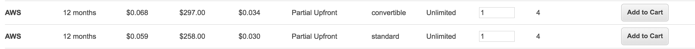
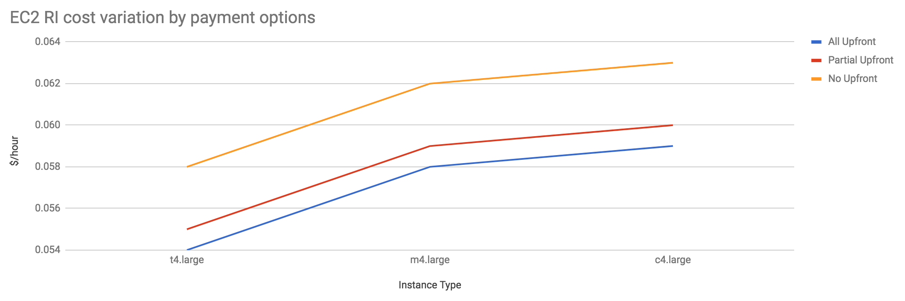

# EC2
Click to expand any section.
## Pricing

  

EC2 Pricing
  

There are 3 ways to pay for EC2 instances.

* *On-Demand*

  Start/stop these instances any time you want. Pay per hour rate.
* *Reserved Instances*

  You make long term commitment (1 or 3 years) to get a discounted hourly rate. You can pay all upfront, partial upfront or no upfront money. The rest is charged per month whether you use the instance or not.
* *Spot Instances*

  This is excess AWS capacity at a discounted hourly rate. Pay per hour for the time it's running.

## Cost optimization tips

  

Use Reserved Instances (RIs)
  

### Use Reserved Instances (RIs)
If you manage at least ten ec2 instances & haven’t heard of RI then this is going to be the biggest cost saver for you. Simply put, you rent out EC2 instances on a contract for a 1 year or 3 year term. You can pay the cost all upfront, partial upfront or no upfront. The more money you put upfront the higher discount you get. Reserved instances come in 2 offerings,

* *Standard*: Less flexibility, more discount. You can change instance size & Availability Zone (AZ) but you can’t change instance family.
* *Convertible*: More flexibility, less discount. You can change instance size, instance family and AZ.

### Recommendations
* Choose an instance family suitable for your workload and go for the standard offering. It’s about ~14% cheaper than convertible RIs plus you can sell excess capacity on the RI marketplace if you ever need to.

* The difference between no upfront to full upfront is moderate (~7%). While the difference between partial upfront and full upfront is tiny (~2%). Best to at least pay partial upfront unless you are cash strapped.

 

  

Turn machines on/off with AWS Instance Scheduler
  

### Turn machines on/off with AWS Instance Scheduler
You can keep the EC2 instances running only for the time range you specify with [AWS Instance Scheduler](https://aws.amazon.com/answers/infrastructure-management/instance-scheduler/). This feature was launched in Feb 2018 and uses combination Cloudwatch, Lambda, and DynamoDB to get everything working.

### Recommendations
Use it for all periodic workloads including developer machines, dev/test/QA stack etc. For a 720 hour every month these machines are typically needed only for ~220 hours.

 

  

Use Spot Fleets
  

### Spot Fleets
[Spot instances](https://aws.amazon.com/ec2/spot/) are essentially excess capacity of AWS available at large discount (~90%) than on-demand rate. Spot instance price fluctuates based on demand & supply. One can set a bid amount the he/she is willing to spend on a spot instance. The catch is if the spot price exceeds your bid price then the instance is terminated with a 2 minute notice.

### Recommendations
* Spinning up one off spot instance is useless as it can die anytime. Consider using [Spot Fleets](https://docs.aws.amazon.com/AWSEC2/latest/UserGuide/spot-fleet.html) that try to maintain set number of spot instances.
* Only use this for stateless workloads.
* It’s best to create a separate auto scaling group (ASG) consisting of only spot instances and hook it behind an Application Load Balancer (ALB) along with existing ASG comprising of RIs + on-demand instances.
* Consider using [autospotting](https://github.com/cristim/autospotting) for few niceties [over](https://github.com/cristim/autospotting/blob/master/FAQ.md#how-does-autospotting-compare-to-the-the-spot-fleet-aws-offering) spot fleets.

 